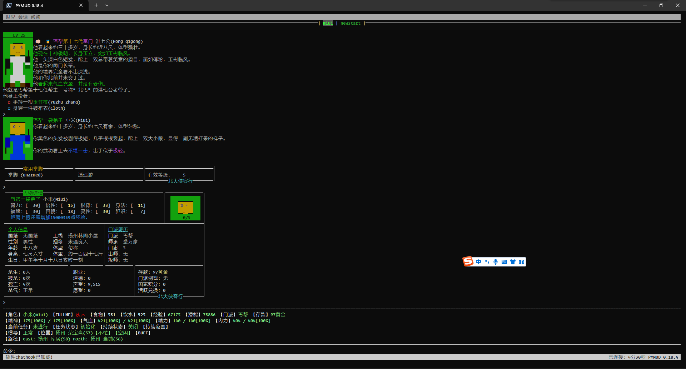

.. pymud-cookbook documentation master file, created by
   sphinx-quickstart on Sun Feb  4 09:39:35 2024.
   You can adapt this file completely to your liking, but it should at least
   contain the root `toctree` directive.

PyMUD 帮助文档
==========================================

有关链接
^^^^^^^^^

- QQ交流群: `554672580 <http://qm.qq.com/cgi-bin/qm/qr?_wv=1027&k=xRiuBmhdZ5EpYd6djSY4xTdi6fdo2PDk&authKey=Rv0zHUgcMoMJ7TT%2F4Uj%2BYpohBawOk%2BsZstZkWzyo8kKCwXuRYgSyyAUoMzTPlGS7&noverify=0&group_code=554672580>`_
- GitHub地址: https://github.com/crapex/pymud
- PyPi地址: https://pypi.org/project/pymud
- 北侠wiki地址: https://www.pkuxkx.net/wiki/tools/pymud
- 北侠地址: https://www.pkuxkx.net/
- deepwiki自动生成的项目理解文档地址: https://deepwiki.com/crapex/pymud
- PyMUD用户shanghua写的入门教程文档: https://www.pkuxkx.net/forum/forum.php?mod=viewthread&tid=49999&forumuid=12067

写在最前面的话
^^^^^^^^^^^^^^^

最早想要自己写MUD客户端的念头，还是在几年前。但前几年事情太多，人太忙，我记得自20年疫情之后，到今年年初就没有再登陆过北侠了。
23年春节之后空闲一些，于2023年2月19日重启MUD客户端的计划，2023年5月29日形成第一个发布版（0.05b），2023年12月5日发布首个支持
pip安装的package版本（0.15），目前发布pip安装的最新版为0.22.0。

在自己写客户端之前，我主要用过zmud和mushclient两个客户端，北大侠客行一直是用mushclient（玩的那会儿还没有mudlet）。
我认为mushclient是一个功能非常强大的客户端，唯一缺点是不支持跨平台。由于工作原因，上班的地方不能上网，手机玩的话，
确实没有特别适合的跨平台客户端（tintint--倒是支持，但一直不想重学然后重写我在mushclient里的所有python脚本），
加上我是一个程序爱好者，所以决定自己干起，正好在游戏之中学习了。

因为我要综合平衡工作、生活、写代码、当然还有自己玩，所以整个更新节奏不会很快，但我认为我会一直更新下去的。
感谢北大侠客行巫师团队的努力，北侠吸引我玩的动力，也是我不断更新完善客户端的动力!

特点
^^^^^^^^^

+ 原生Python开发，除 `prompt-toolkit <https://python-prompt-toolkit.readthedocs.io>` 及其依赖库 wcwidth, pygment, pyperclip 外，不需要其他第三方库支持
+ 原生Python的asyncio实现的通信协议处理，支持async/await语法在脚本中直接应用，脚本实现的同步异步两种模式由你自己选择
+ 基于控制台的全屏UI界面设计，支持鼠标操作（Android上支持触摸屏操作），极低资源需求，在单核1GB内存的Linux VPS上也可流畅运行
+ 支持分屏显示，在数据快速滚动的时候，上半屏保持不动，以确保不错过信息
+ 解决了99%情况下，北大侠客行中文对不齐，也就是看不清字符画的问题
+ 真正的支持多session会话，支持命令或鼠标切换会话
+ 原生支持多种服务器端编码方式，不论是GBK、BIG5、还是UTF-8
+ 支持NWAS、MTTS协商，支持GMCP、MSDP、MSSP协议
+ 一次脚本开发，多平台运行。只要能在该平台上运行python，就可以运行PyMUD客户端
+ 脚本所有语法均采用Python原生语法，因此你只要会用Python，就可以自己写脚本，免去了再去学习lua、熟悉各类APP的使用的难处
+ 全开源代码，因此脚本也可以很方便的使用visual studio code等工具进行调试，可以设置断点、查看变量等
+ Python拥有极为强大的文字处理能力，用于处理文本的MUD最为合适
+ Python拥有极为丰富的第三方库，能支持的第三方库，就能在PyMUD中支持
+ 多语言支持框架已搭好，目前提供中文、英文支持，可以自己增加翻译后的其他语言版本
+ 我自己还在玩，所以本客户端会持续进行更新:)

**美化对齐的字符画**

.. image:: _static/ui_show_01.png
   :alt: 美化对齐的字符画

**滚动时自动分屏**

.. toctree::
   :maxdepth: 3
   :caption: 目录

   installation
   ui
   settings
   syscommand
   hotkeys
   scripts
   plugins
   references
   updatehistory
   

索引与表
==================

* :ref:`genindex`
* :ref:`modindex`
* :ref:`search`