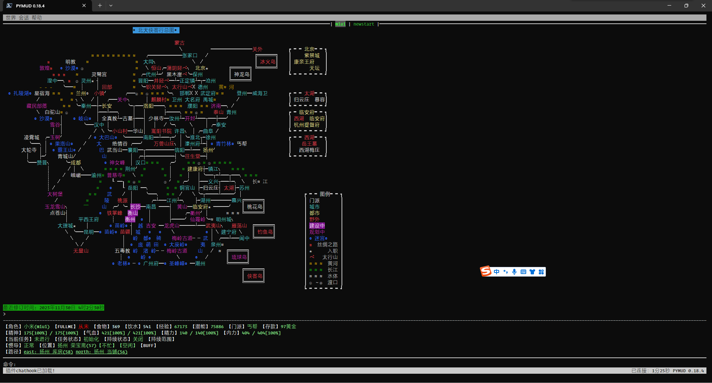
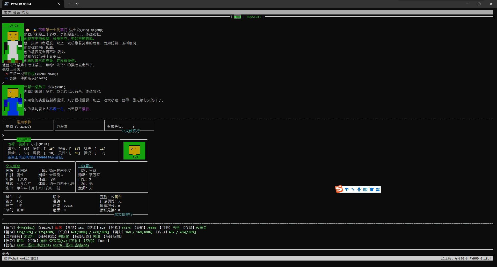

PyMUD文档
==========================================

有关链接
^^^^^^^^^

- 官方网站: https://www.pymud.cn
- 官方文档: https://www.pymud.cn/doc
- 官方论坛: https://bbs.pymud.cn
- QQ交流群: `554672580 <http://qm.qq.com/cgi-bin/qm/qr?_wv=1027&k=xRiuBmhdZ5EpYd6djSY4xTdi6fdo2PDk&authKey=Rv0zHUgcMoMJ7TT%2F4Uj%2BYpohBawOk%2BsZstZkWzyo8kKCwXuRYgSyyAUoMzTPlGS7&noverify=0&group_code=554672580>`_
- GitHub地址: https://github.com/crapex/pymud
- PyPi地址: https://pypi.org/project/pymud
- deepwiki自动生成的项目理解文档地址: https://deepwiki.com/crapex/pymud

特点
^^^^^^^^^

+ 原生Python开发，除 `prompt-toolkit <https://python-prompt-toolkit.readthedocs.io>` 及其依赖库 wcwidth, pygments, pyperclip 外，不需要其他第三方库支持
+ 原生Python的asyncio实现的通信协议处理，支持async/await语法在脚本中直接应用，脚本实现的同步异步两种模式由你自己选择
+ 支持多IP地址设备对应出口IP的选择，支持通过socks5代理来连接服务器而不需要进行额外操作或安装额外软件
+ 基于控制台的全屏UI界面设计，支持鼠标操作（Android上支持触摸屏操作），极低资源需求，在单核1GB内存的Linux VPS上也可流畅运行
+ 支持分屏显示，在数据快速滚动的时候，上半屏保持不动，以确保不错过信息。支持自定义分屏比例，更好的满足不同用户的需求。
+ 解决了99%情况下，中文类MUD在控制台中对不齐，看不清字符画的问题
+ 支持真正的多session会话，支持命令或鼠标切换会话
+ 原生支持多种服务器端编码方式，不论是GBK、BIG5、还是UTF-8
+ 支持NWAS、MTTS协商，支持GMCP、MSDP、MSSP协议
+ 一次脚本开发，多平台运行。只要能在该平台上运行python，就可以运行PyMUD客户端
+ 支持成组管理、组与子组管理功能，可以方便的使用脚本或者命令成组进行操作
+ 独有的的命令框架Command对象, 可以有效以模块化方式组织自己的脚本
+ 完善的插件系统，可以很方便的将自己的脚本或者功能模块以插件的形式进行组织后进行共享发布
+ 脚本所有语法均采用Python原生语法，因此你只要会用Python，就可以自己写脚本，免去了再去学习lua、熟悉各类APP的使用的难处
+ 全开源代码，因此脚本也可以很方便的使用visual studio code等工具进行调试，可以设置断点、查看变量等
+ 完整的多语言支持框架，目前提供中文、英文支持，可以自己增加翻译后的其他语言版本

**美化对齐的字符画**

**滚动时自动分屏**

.. toctree::
   :maxdepth: 3
   :caption: 帮助文档

   installation
   ui
   settings
   syscommand
   hotkeys
   scripts
   plugins
   references
   updatehistory

.. toctree::
    :maxdepth: 1
    :caption: 外部链接

    官方网站 <https://www.pymud.cn>
    官方论坛 <https://bbs.pymud.cn>
    QQ交流群 <http://qm.qq.com/cgi-bin/qm/qr?_wv=1027&k=xRiuBmhdZ5EpYd6djSY4xTdi6fdo2PDk&authKey=Rv0zHUgcMoMJ7TT%2F4Uj%2BYpohBawOk%2BsZstZkWzyo8kKCwXuRYgSyyAUoMzTPlGS7&noverify=0&group_code=554672580>
    GitHub <https://github.com/pymud/pymud>

索引与表
==================

* :ref:`genindex`
* :ref:`modindex`
* :ref:`search`
