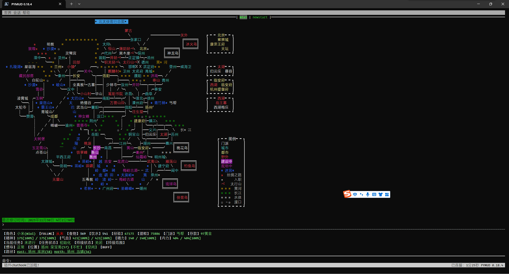

.. pymud-cookbook documentation master file, created by
   sphinx-quickstart on Sun Feb  4 09:39:35 2024.
   You can adapt this file completely to your liking, but it should at least
   contain the root `toctree` directive.

PYMUD 帮助文档
==========================================

有关链接
^^^^^^^^^

- QQ交流群: 554672580
- GitHub地址: https://github.com/crapex/pymud
- PyPi地址: https://pypi.org/project/pymud
- 北侠wiki地址: https://www.pkuxkx.net/wiki/tools/pymud
- 北侠地址: https://www.pkuxkx.net/

写在最前面的话
^^^^^^^^^^^^^^^

最早想要自己写MUD客户端的念头，还是在几年前。但前几年事情太多，人太忙，我记得自20年疫情之后，到今年年初就没有再登陆过北侠了。23年春节之后空闲一些，于2023年2月19日重启MUD客户端的计划，2023年5月29日形成第一个发布版（0.05b），2023年12月5日发布首个支持pip安装的package版本（0.15），目前发布pip安装的最新版为0.18.4post2（2024年2月20日）。

在自己写客户端之前，我主要用过zmud和mushclient两个客户端，北大侠客行一直是用mushclient（玩的那会儿还没有mudlet）。我认为mushclient是一个功能非常强大的客户端，唯一缺点是不支持跨平台。由于工作原因，上班的地方不能上网，手机玩的话，确实没有特别适合的跨平台客户端（tintint--倒是支持，但一直不想重学然后重写我在mushclient里的所有python脚本），加上我是一个程序爱好者，所以决定自己干起，正好在游戏之中学习了。

因为我要综合平衡工作、生活、写代码、当然还有自己玩，所以整个更新节奏不会很快，但我认为我会一直更新下去的。感谢北大侠客行巫师团队的努力，北侠吸引我玩的动力，也是我不断更新完善客户端的动力!

特点
^^^^^^^^^

- 原生纯Python开发，除prompt-toolkit及其依赖库（wcwidth, pygments, pyperclip）外，不需要其他第三方库支持
- 使用原生asyncio库进行网络和事务处理，支持async/await语法的原生异步操作（PYMUD最大特色）。原生异步意味着可以支持很多其他异步库，例如可以使用aiohttp来进行网络页面访问而不产生阻塞等等:)
- 基于控制台的全屏UI界面设计（无需图形环境，如linux下的X环境）。同时支持鼠标操作（可触摸设备上支持触摸屏操作）
- 支持分屏显示，在数据快速滚动的时候，上半屏保持不动，以确保不错过信息
- 解决了99%情况下，北大侠客行中文对不齐，也就是看不清字符画的问题（因为我没有走遍所有地方，不敢保证100%）
- 真正的支持多session会话，支持命令和鼠标切换会话
- 原生支持多种服务器端编码方式，不论是GBK、BIG5、还是UTF-8
- 支持NWAS、MTTS协商，支持GMCP、MSDP、MSSP协议。暂不支持MXP
- 一次脚本开发，多平台运行。Windows, Linux, MacOS, Android（基于termux）, iOS（基于iSH）。可部署在docker和云端，只要能在该平台上运行Python，就可以运行PYMUD客户端
- 脚本所有语法均采用Python原生语法，因此你只要会用Python，就可以自己写脚本，免去了再去学习lua、熟悉各类APP的使用的难处
- 全开源代码，因此脚本也可以很方便的使用visual studio code等工具进行调试，可以设置断点、查看变量等
- Python拥有极为强大的文字处理能力，用于处理文本的MUD最为合适
- Python拥有极为丰富的第三方库，能支持的第三方库，就能在PYMUD中支持
- 我自己还在玩，所以本客户端会持续进行更新:)

美化对齐的字符画
--------------------

滚动时自动分屏
--------------------

.. toctree::
   :maxdepth: 3
   :caption: 目录

   installation
   ui
   scripts
   advanced
   files/index
   updatehistory
   

索引与表
==================

* :ref:`genindex`
* :ref:`modindex`
* :ref:`search`