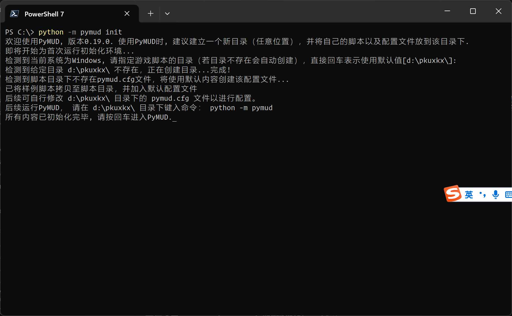
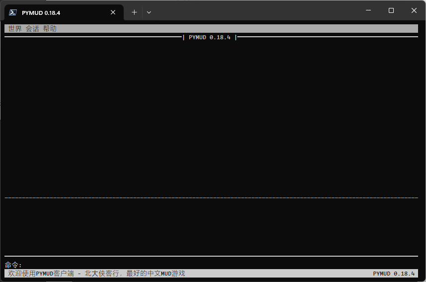
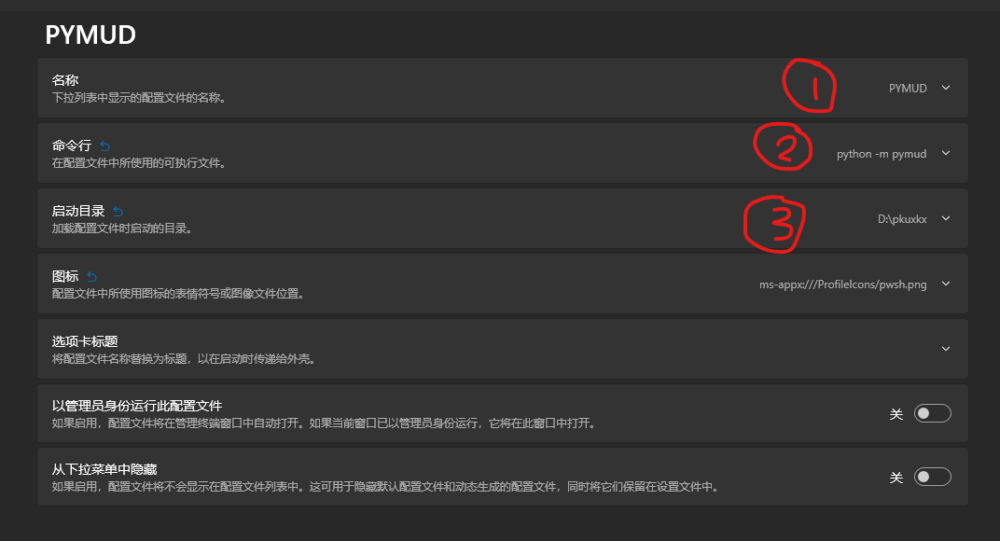

1 需求、安装与运行
======================

1.1 环境需求
----------------------

PyMUD是一个原生基于Python语言的MUD客户端，因此最基本的环境是Python环境而非操作系统环境。
理论上，只要你的操作系统下可以运行Python，就可以运行PyMUD。
另外，本客户端的UI设计是基于控制台的，因此也不需要有图形环境的支持，可以方便的部署在云端和docker中。

- 操作系统需求：不限，能运行Python是必要条件。可以windows（推荐使用 `Windows Terminal`_ 作为终端）、linux（不需要X支持）、macOS、Android（使用termux）、iOS（使用iSH）。
- 版本需求：要求 >=3.7(已测试3.7.9,更旧的版本不确定能否使用，请自行尝试），32位/64位随意，建议用64位版，可以支持4G以上的内存访问。
- 支持库需求：prompt-toolkit 3.0（ `prompt toolkit 3 source`_ ), 以及由 ``prompt-toolkit`` 所依赖的 ``wcwidth、pygment、pyperclip`` 。
- prompt-toolkit 帮助页面： `prompt toolkit 3 help`_

1.2 安装
----------------------

- 安装Python、pip（linux下pip是一个单独的包，debian/ubuntu可以使用 ``apt-get`` 分别安装）。
- 使用pip安装（或更新）PyMUD程序本体：可以直接使用pip安装或更新。所需的支持库会自动安装。
- 在Python 3.12 版本下，

.. code:: bash

    pip install pymud                                       # 安装
    pip install --upgrade pymud                             # 更新
    pip install --upgrade pymud==0.20.0                     # 指定版本  
    pip install --upgrade pymud==0.20.0a1 -i https://pypi.org/simple  # 指定pypi官方源。由于镜像同步需要时间，所以有时候刚发布更新时，需指定到pypi官方源     

1.3 初始化环境
----------------------

PyMUD 支持通过命令行参数进行启动配置。可以通过 ``pymud -h`` 或 ``python -m pymud -h`` 查看有关帮助。

安装后，可以在命令行任意目录下使用 ``pymud init``或 ``python -m pymud init`` 初始化默认环境。

根据该初始化指引，会创建一个脚本目录，在该目录下生成包含主要配置的 ``pymud.cfg`` 配置文件，以及一个示例的 ``examples.py`` 脚本文件。

初始化示例见下图：

1.4 运行
----------------------

PyMUD 通过在当前目录下直接键入命令 ``pymud`` 或使用Python的标准模块调用语法 ``python -m pymud`` 执行。建议建立自己的脚本目录，通过命令行指定该目录，或者将当前目录切换至该目录下后执行。

PyMUD 支持命令行参数配置启动行为。具体参数及含义可以通过增加 -h 或者 --help 查看。列出如下：

.. code:: 

    PS C:\> pymud -h
    usage: pymud [-h] [-d] [-l logfile] [-a] [-s startup_dir] {init} ...

    PyMUD命令行参数帮助

    positional arguments:
        {init}                init用于初始化运行环境

    options:
        -h, --help            show this help message and exit
        -d, --debug           指定以调试模式进入PyMUD。此时，系统log等级将设置为logging.NOTSET, 所有log数据均会被记录。默认不启用。
        -l logfile, --logfile logfile
                              指定调试模式下记录文件名，不指定时，默认为当前目录下的pymud.log
        -a, --appendmode      指定log文件的访问模式是否为append尾部添加模式，默认为True。当为False时，使用w模式，即每次运行清空之前记录
        -s startup_dir, --startup_dir startup_dir
                              指定启动目录，默认为当前目录。使用该参数可以在任何目录下，通过指定脚本目录来启动

    PS C:\> pymud init -h
    usage: usage: pymud init [-h] [-d dir]

    初始化pymud运行环境, 包括建立脚本目录, 创建默认配置文件, 创建样例脚本等.

    options:
        -h, --help         show this help message and exit
        -d dir, --dir dir  指定构建脚本目录的名称, 不指定时会根据操作系统选择不同默认值

.. code::

    # 示例 从脚本目录的当前目录启动 PyMUD
    PS C:\> cd ~\pkuxkx                # 进入自己的脚本目录(可由 pymud init 创建)
    PS C:\Users\home\pkuxkx> pymud     # 直接使用pymud命令运行PyMUD. 也可以使用 python -m pymud 命令，效果相同

    # 示例: 从任意位置通过指定脚本目录启动 PyMUD
    PS C:\> pymud -s ~\pkuxkx

    # 示例: 从任意位置通过指定脚本目录启动 PyMUD, 并打开调试模式
    PS C:\> pymud -d -s ~\pkuxkx

1.5 Windows下安装与启动示例
--------------------------------------------

- 建议使用 `Windows Terminal`_ 作为shell，并使用 `PowerShell 7`_ 作为启动终端
- 使用pip安装pymud，shell中执行: ``pip install pymud``
- 通过init创建自己的脚本目录: ``pymud init``
- 在脚本目录下启动运行pymud: ``pymud`` 或 ``python -m pymud``
- 或者直接在任意目录下，通过命令行指定脚本目录方式运行： ``pymud -s ~\pkuxkx``

启动后的界面
"""""""""""""""""""""""""""""""""""""

在 `Windows Terminal`_ 中增加快捷菜单
"""""""""""""""""""""""""""""""""""""

- 创建一个配置文件（比如从 `PowerShell 7`_ 复制一个）
- 将名称改为你喜欢的名称，如 ``PyMUD``
- 将命令行改为： ``pymud`` 或 ``python -m pymud``
- 将启动目录改为你的脚本目录，比如 d:\\pkuxkx
- 可以自己设置一个喜欢的图标:)

.. _Windows Terminal: https://aka.ms/terminal
.. _PowerShell 7: https://aka.ms/powershell-release?tag=stable
.. _prompt toolkit 3 source : https://github.com/prompt-toolkit/python-prompt-toolkit
.. _prompt toolkit 3 help : https://python-prompt-toolkit.readthedocs.io