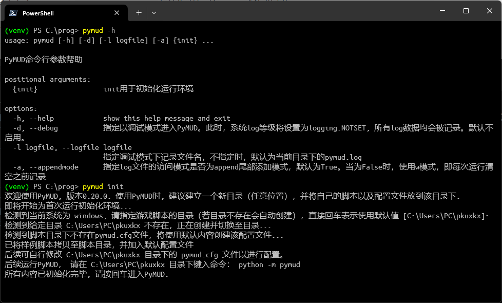
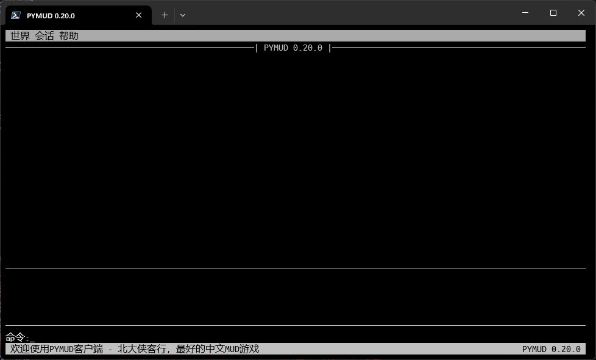

1 需求、安装与运行
======================

1.1 环境需求
----------------------

PyMUD是一个原生基于Python语言的MUD客户端，因此最基本的环境是Python环境而非操作系统环境。
理论上，只要你的操作系统下可以运行Python，就可以运行PyMUD。
另外，本客户端的UI设计是基于控制台的，因此也不需要有图形环境的支持，可以方便的部署在云端和docker中。

- 操作系统需求：不限，能运行Python是必要条件。可以windows（推荐使用 `Windows Terminal`_ 作为终端）、linux（不需要X支持）、macOS、Android（使用termux）、iOS（使用iSH）。
- 版本需求：要求 >=3.7(已测试3.7.9,更旧的版本不确定能否使用，请自行尝试），32位/64位随意，建议用64位版，可以支持4G以上的内存访问。
- 支持库需求：prompt-toolkit 3.0（ `prompt toolkit 3 source`_ ), 以及由 ``prompt-toolkit`` 所依赖的 ``wcwidth、pygment、pyperclip`` 。
- prompt-toolkit 帮助页面： `prompt toolkit 3 help`_

1.2 安装
----------------------

- 安装Python、pip（linux下pip是一个单独的包，debian/ubuntu可以使用 ``apt-get`` 分别安装）。
- 使用pip安装（或更新）PyMUD程序本体：可以直接使用pip安装或更新。所需的支持库会自动安装。
- 在Python 3.12 版本下，

.. code:: bash

    pip install pymud                                       # 安装
    pip install --upgrade pymud                             # 更新
    pip install --upgrade pymud==0.19.1                     # 指定版本  
    pip install --upgrade pymud==0.20.0a1 -i https://pypi.org/simple  # 指定pypi官方源。由于镜像同步需要时间，所以有时候刚发布更新时，需指定到pypi官方源     

1.3 初始化环境
----------------------

PyMUD 支持通过命令行参数进行启动配置。可以通过 ``pymud -h`` 或 ``python -m pymud -h`` 查看有关帮助。

安装后，可以在命令行任意目录下使用 ``pymud init``或 ``python -m pymud init`` 初始化默认环境。

根据该初始化指引，会创建一个脚本目录，在该目录下生成包含主要配置的 ``pymud.cfg`` 配置文件，以及一个示例的 ``examples.py`` 脚本文件。

初始化示例见下图：

1.4 运行
----------------------

PyMUD 通过在当前目录下直接键入命令 ``pymud`` 或使用Python的标准模块调用语法 ``python -m pymud`` 执行。建议建立自己的脚本目录，并在该目录下执行。

.. code:: powershell

    cd ~/pkuxkx        # 进入自己的脚本目录(可由 python -m pymud init 创建)
    python -m pymud    # 运行PyMUD
    pymud              # 也可以直接使用pymud命令运行PyMUD

1.5 Windows下安装与启动示例
--------------------------------------------

- 建议使用 `Windows Terminal`_ 作为shell，并使用 `PowerShell 7`_ 作为启动终端
- 使用pip安装pymud，shell中执行: ``pip install pymud``
- 创建自己的脚本目录，如 d:\\pkuxkx： ``mkdir pkuxkx``
- 进入自己的脚本目录， ``cd pkuxkx``
- 启动运行pymud: ``pymud`` 或 ``python -m pymud``

安装步骤
"""""""""""""""""""""""""""""""""""""

启动后的界面
"""""""""""""""""""""""""""""""""""""

在 `Windows Terminal`_ 中增加快捷菜单
"""""""""""""""""""""""""""""""""""""

- 创建一个配置文件（比如从 `PowerShell 7`_ 复制一个）
- 将名称改为你喜欢的名称，如 ``PyMUD``
- 将命令行改为： ``pymud`` 或 ``python -m pymud``
- 将启动目录改为你的脚本目录，比如 d:\\pkuxkx
- 可以自己设置一个喜欢的图标:)

.. image:: _static/create_menu_win.png

.. _Windows Terminal: https://aka.ms/terminal
.. _PowerShell 7: https://aka.ms/powershell-release?tag=stable
.. _prompt toolkit 3 source : https://github.com/prompt-toolkit/python-prompt-toolkit
.. _prompt toolkit 3 help : https://python-prompt-toolkit.readthedocs.io