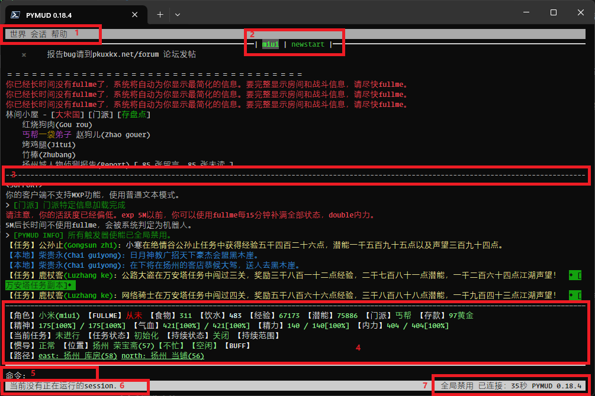

2 界面和操作
=====================

2.1 界面
---------------------

下图是主要界面，用1-7标注出7个主要内容，含义如下：

1. 菜单栏，可以鼠标操作（手机上是触控），目前包括3个1级菜单。
2. 多会话的显示和切换标签。多个会话时，每一个会话的名称会在此处，灰底亮字的是当前会话。颜色为绿色的表示当前会话处于连接状态，未处于连接状态的为白色（灰色）。可以直接单击会话名称切换会话。键盘的话，Ctrl+左右箭头可以切换。
3. 中间分隔线。当向上滚动或翻页的时候，会产生中间分隔线，此时上半部分不再滚动，下半部分持续滚动显示最新的消息。取消分隔的话，可以向下滚动到底，或者Ctrl-Z快捷键取消（仿zmud操作）。上下翻页只能使用鼠标滚轮，或者PageUp / PageDown按键。鼠标滚轮是一次一行，键盘是一次一页。
4. 状态窗口。可以使用函数自定义状态窗口显示内容，图例是我自己定义的状态窗口显示内容。
5. 命令输入行。命令输入行支持历史记录、以及基于历史记录的自动建议和自动完成。键盘上下方向键可以在历史记录中选择，键盘右键实现历史记录建议的自动完成。比如前面输入过ask pu about job，后面输入ask的时候，后面的 pu about job会以灰色显示（表示自动建议），只需键盘右箭头，即可完成输入。
6. 状态栏，显示状态信息，用于显示部分运行时的状态信息（比如复制内容），也可以在代码中通过 ``session.application.set_status`` 来设置显示的文字。
7. 状态栏（右），显示鼠标状态、全局触发器状态、连接状态和连接时间。其中，鼠标状态（显示为：鼠标已禁用）和全局触发器状态（显示为：全局禁用）仅在禁用情况下显示。另外，因为基于控制台的ui不是实时刷新，因此链接的时间有时会滞后显示，看上去就是秒不在跳动，不影响时间记录。

2.2 菜单
---------------------

当前UI中共有3个一级菜单，分别为：世界、会话、帮助

2.2.1 世界
^^^^^^^^^^^^^^^^^^^^^^

- **创建新会话:** 

    使用ui界面创建一个新会话

    .. image:: _static/ui_new_session_1.png
        :alt: 创建会话菜单

    .. image:: _static/ui_new_session_2.png
        :alt: 创建会话窗口

- **退出:** 

    退出PYMUD应用

- **创建新会话与退出中间的菜单**

    在没有指定自定义配置时，该菜单默认是读取包中的settings.py创建。该菜单可以自行配置，配置方法如下：

    在当前目录下（当前目录即指运行 python -m pymud 的某个目录，可自行设置，如 d:\pkuxkx\）新建pymud.cfg文件，将下列内容拷贝复制进去（内容为json格式，该json文件不支持注释）：

    .. code:: json

        {
            "sessions": {
                "pkuxkx" : {
                    "host" : "mud.pkuxkx.net",
                    "port" : "8081",
                    "encoding" : "utf8",
                    "autologin" : "{0};{1}",
                    "default_script": ["pkuxkx.common", "pkuxkx.commands", "pkuxkx.main"],
                    "chars" : {
                        "char1": ["yourid1", "yourpassword1"],
                        "char2": ["yourid2", "yourpassword2", "pkuxkx.wudang"],
                        "char3": ["yourid3", "yourpassword3", "pkuxkx.wudang,pkuxkx.lingwu"],
                        "char4": ["yourid4", "yourpassword4", ["pkuxkx.shaolin","pkuxkx.lingwu"]]
                    }
                }
            }
        }

    其中，要修改的部分包括：

      - default_script: 所有角色均会加载的脚本
      - char1, char2, char3, char4: 需要添加的角色在菜单上显示的内容（每一个角色会生成一个菜单项）
      - 每一个角色后面的3个对象含义为：yourid即角色id，yourpassword即角色密码,该角色单独加载的脚本（可以使用逗号或者列表指定多个，也可以没有）

    此时，再次在d:\\pkuxkx\\下执行 ``python -m pymud`` 时，会生成如下菜单

    .. image:: _static/chars_menu.png
        :alt: 会话菜单

2.2.2 会话
^^^^^^^^^^^^^^^^^^^^^^

- **连接/重新连接**

    将当前会话重新连接到服务器。若没有当前会话、或当前会话处于连接状态时，该菜单操作无效。可以在命令行使用 ``#connect`` 或 ``#con`` 实现同样功能

- **断开连接**

    将当前会话从服务器断开。若没有当前会话、或当前会话已处于断开状态时，该菜单操作无效。

- **关闭当前会话**

    关闭当前会话窗口。若没有当前会话时，该菜单操作无效。若当前会话处于连接状态时，此操作会弹出确认提示框。可以在命令行使用 ``#close`` 实现同样功能。

- **打开/关闭自动重连**

    切换应用的自动重连功能。该功能默认由 `settings.py <files/settings.py.html>`_ 中， `client` 下的 `auto_reconnect` 配置所确定。该配置可以被 `pymud.cfg` 覆盖。该设置会对所有会话生效。

- **显示/隐藏输入指令**

    切换会话命令输入时是否在主窗口中是否回显。该功能默认由 `settings.py <files/settings.py.html>`_ 中， `client` 下的 `echo_input` 配置所确定。该配置可以被 `pymud.cfg` 覆盖。该设置会对所有会话生效。

- **取消分屏**

    当窗口信息较多，向上滚动时（支持鼠标滚动和PageUp翻页键），会自动分屏。该菜单操作会取消分屏，将显示回到最底部。可以通过快捷键 Ctrl + Z 实现同样功能。

- **复制（纯文本）**

    将选中内容以纯文本形式复制到剪贴板。选中操作使用鼠标完成。可以支持字符选择、行选择（鼠标双击该行）、多行选择模式。
    其中，多行模式下，复制会复制所有行内容，而不论起始和终止选择位置是否位于行首和行尾。

    可以通过快捷键 Ctrl + C 实现同样功能。

    *注: 在远程ssh使用tmux作为终端时，复制到剪贴板后，只有pymud可以识别复制内容，本地剪贴板不能识别复制。*

- **复制（ANSI）**

    将选中内容的原始ANSI代码复制到剪贴板。在进行颜色代码判断是，需要复制原始颜色代码，该命令适用。
    由于显示区间定位问题，ANSI复制建议使用整行复制或者多行复制，否则有可能复制内容不是实际需要的内容。

    可以通过快捷键 Ctrl + R 实现同样功能。

    *注: 在远程ssh使用tmux作为终端时，复制到剪贴板后，只有pymud可以识别复制内容，本地剪贴板不能识别复制。*

- **清空会话内容**

    清空当前会话缓冲的 **所有** 显示内容。

    当前会话缓冲的行数由settings.py中，client下的buffer_lines配置指定。该配置可以被pymud.cfg覆盖。

    缓冲行数逻辑为，当已缓冲行数达到buffer_lines的两倍时，且屏幕未处于分屏状态下，会保留后buffer_lines行数内容，前面内容自动清除。

- **重新加载脚本配置**

    当修改过脚本文件之后，为使修改生效，可以使用该菜单操作。可以通过命令行输入#reload实现同样功能。

    *注：重新加载脚本文件仅在脚本文件没有语法错误的情况下会生效，若某次加载时存在语法错误，后续重新加载无法加载改正后的脚本，
    需要退出pymud重新进入，或者将原错误脚本生成的中间文件.pyc文件删除后，再重新使用#load加载。*

2.2.3 帮助
^^^^^^^^^^^^^^^^^^^^^^

- **关于**

    关于菜单会显示一个窗口，包含PYMUD的版本号、系统和系统版本、Python环境的版本等内容。

    窗口中包含了帮助文档的地址，鼠标单击可以链接到本页面。

2.3 会话与连接管理
---------------------

可以使用以下三种方式创建会话

- 使用创建新会话菜单创建，见菜单说明
- 创建快捷菜单，见菜单说明
- 使用 `#session <syscommand.html#session>`_ 命令可以创建新会话。命令使用如下:

    .. code:: 

        #session {session_name} {host} {port} {encoding}

    大括号内容分别代表会话名称、服务器地址、端口、编码方式（编码方式可不显式指定，此时默认为utf-8编码）。例如，使用下列命令可以创建一个名为 ``newstart`` 的会话并连接到北侠。

    .. code:: 

        #session newstart mud.pkuxkx.net 8081
